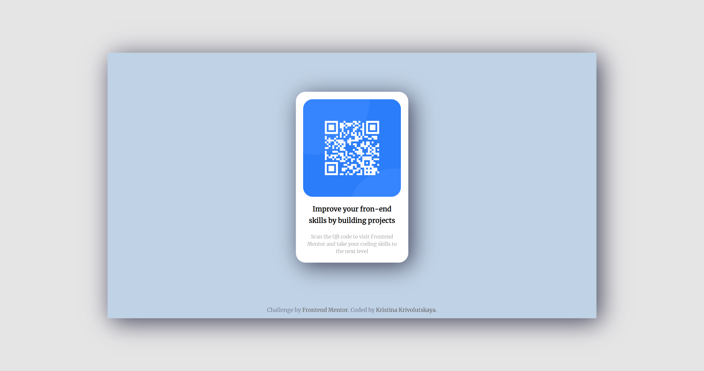
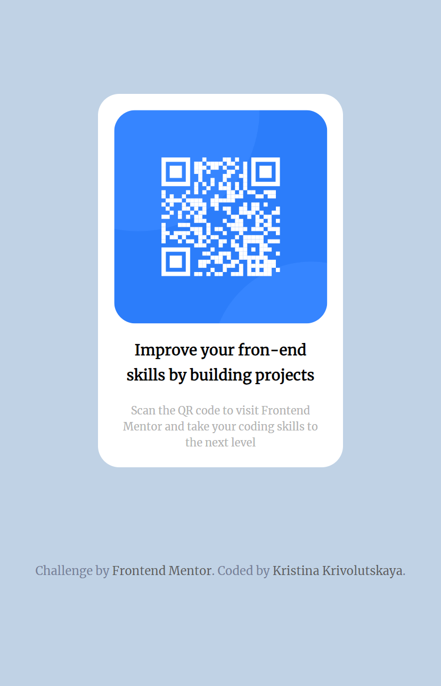

# Frontend Mentor - QR code component solution

This is a solution to the [QR code component challenge on Frontend Mentor](https://www.frontendmentor.io/challenges/qr-code-component-iux_sIO_H). Frontend Mentor challenges help you improve your coding skills by building realistic projects. 

## Table of contents

- [Overview](#overview)
  - [Screenshot](#screenshot)
  - [Links](#links)
- [My process](#my-process)
  - [Built with](#built-with)
  - [What I learned](#what-i-learned)
  - [Useful resources](#useful-resources)
- [Author](#author)

**Note: Delete this note and update the table of contents based on what sections you keep.**

## Overview

### Screenshot

### Links

- Live Site URL: [Page netlify](https://qr-qode-component-solution.netlify.app/)

## My process

### Built with

- Semantic HTML5 markup
- CSS custom properties
- Flexbox

### What I learned

This task was done in one hour. 

### Useful resources

- The colors were selected using the site: [The super fast color paletts generator](https:/coolors.co/) - 
- Box-shadow was generate with: [A simple generator that will help you choose the right values for selected CSS properties](https://cssgenerator.pl/en/)

## Author

- Website - [Kristina Krivolutskaya](https://kristinana97.github.io/CV/)
